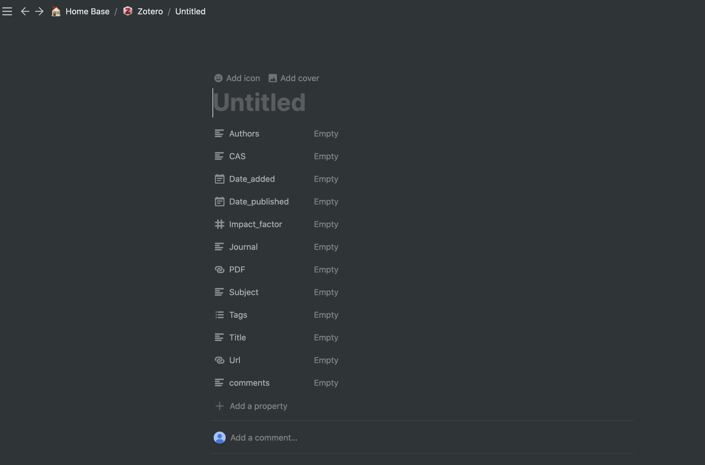
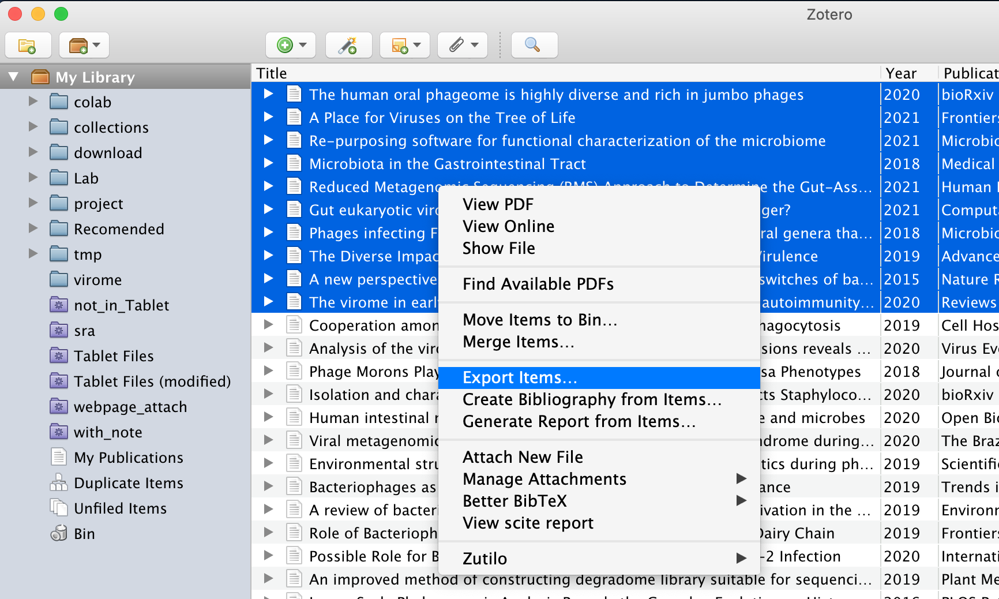
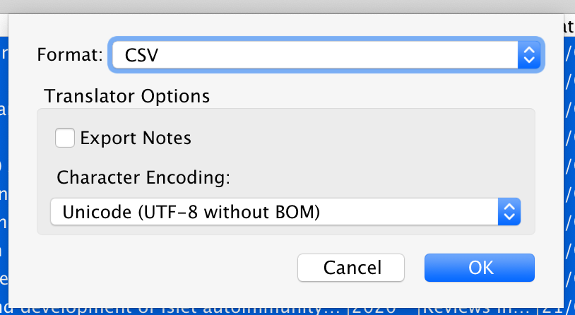
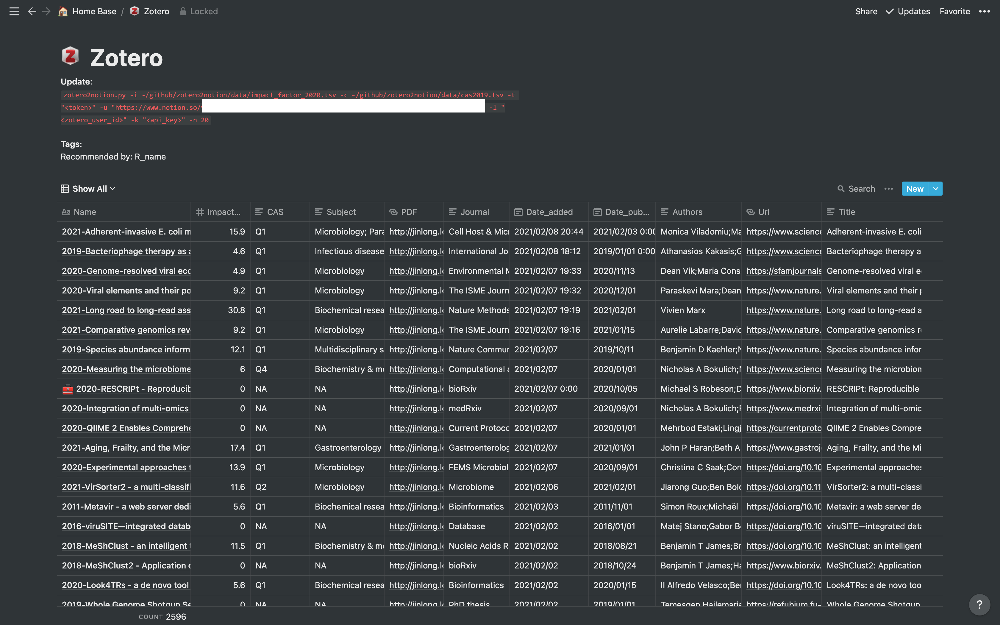

# notion_zotero

Import Zotero library to Notion 

## Requirements

- Python 3
- [notion-py](https://github.com/jamalex/notion-py)
- pandas
- click


## Usage

1. Clone or download repo 

2. Create a database with following columns in Notion, and copy the database url



3. Obtain the `token_v2` value by inspecting your browser cookies on a logged-in session on Notion.so

4. Export zotero library (or selected records) as a csv format file (ex. export.csv)




5. Run command

```sh
zotero2notion.py -z export.csv -i data/impact_factor_2020.tsv -c data/cas2019.tsv -t "<token>" -u "<notion database url>"
```


